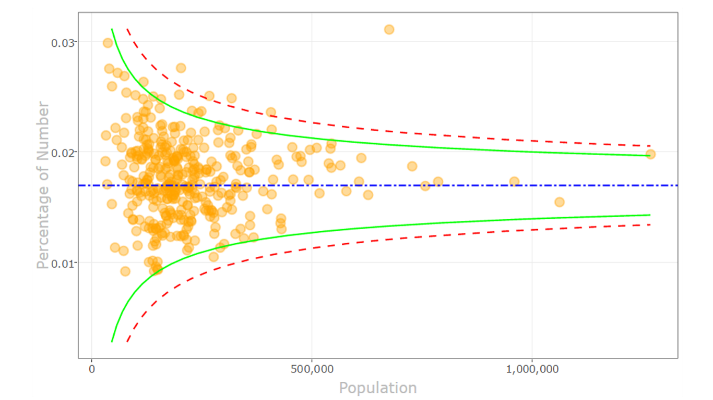

# Funnel plot

> Find outliers in your data, using a funnel plot.

# Overview

On occasion, we find patterns in statistical noise that lead us to incorrect conclusions about the underlying data. 
 
The funnel plot helps you compare samples, and find true outliers among the measurements with varying precision. It’s widely used for comparing institutional performance and medical data analysis. 
In our example, the measurements are rates of certain events (such as births) in populations (such as countries) of given size.     
This visual uses a fixed effect model estimator. You can control the visual attributes to suit your needs.     

NEW: support for tooltips on hover and selection.

Here is how it works: 
- Define two required fields to be analyzed in plot (occurrence and population fields)
- Optionally, provide the fields to be shown in tooltips upon hover
- You may select the Y axis to present percentage or ratio
- Use numerous formatting controls to refine the visual appearance of the plot
- The "funnel" is formed by confidence limits, and show the amount of expected variation. The dots outside the funnel are outliers.

R package dependencies (which are auto-installed): scales, reshape, ggplot2, plotly,  htmlwidgets, XML
Supports R versions: R 3.4.0, R 3.3.3, R 3.3.2, MRO 3.2.2 

This is an open source visual. Get the code from GitHub: https://github.com/Microsoft/powerbi-visuals-funnel

# Contributing

This project has adopted the [Microsoft Open Source Code of Conduct](https://opensource.microsoft.com/codeofconduct/). For more information see the [Code of Conduct FAQ](https://opensource.microsoft.com/codeofconduct/faq/) or contact [opencode@microsoft.com](mailto:opencode@microsoft.com) with any additional questions or comments.
